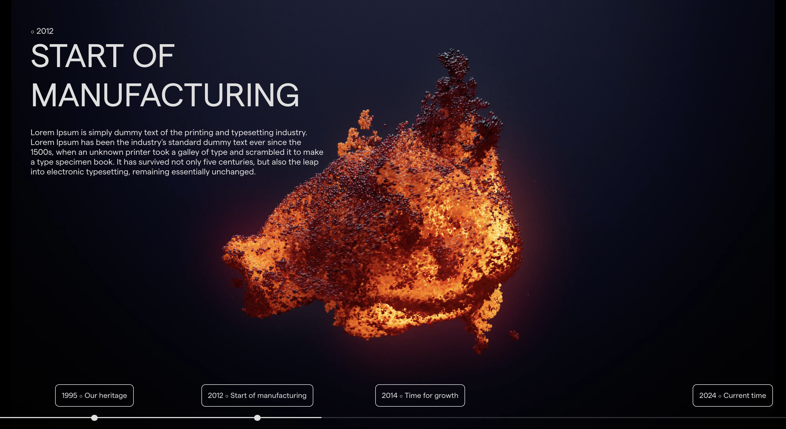

# Lenis Smooth Scroll

 

This project is a simple and lightweight smooth scroll with an animated progress bar. It is easy to use and responsive. It is built with HTML, CSS, and JavaScript.

## Features

- Smooth Scroll
- Animated Progress Bar
- Responsive Design
- Easy to Use
- Lightweight
- No Dependencies

## Usage

To use this, open the `index.html` file in your web browser.

## Author

- [Farid Vatani - Software Engineer](https://github.com/faridvatani)

## Contributing

Contributions are welcome. Please feel free to fork this repository and open a pull request to add more features, fix bugs, improve documentation etc.

## Acknowledgements

This project was inspired by the "Awwwards Element" from [q-industrial](https://www.q-industrial.com/about).

## License

This project is licensed under the MIT License. See the [LICENSE](LICENSE) file for more details.
